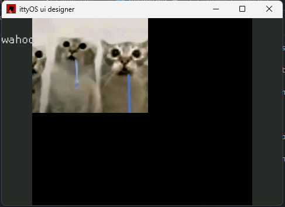
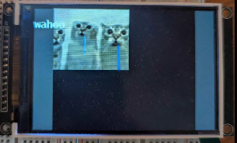

# ittyOS ui designer

a rust tool to design UI screens that transpile to C code.

use `ittyOS-ui-designer <target_file_name>`, ex `ittyOS-ui-designer gameUI.c`, to create that ui file.

it will also generate a header file. when editing that UI in the future, simply use the same command on the existing file.

currently, the program displays a representation of the UI, and live updates the c code when the config is changed. (buggy).

## important:

1. the code generated is not an entire program, just a function that draws a screen of ui!

2. as of right now, the generated code will not work out of the box! some parts will have to be tweaked for it to properly compile. this is a WIP

## todo:

* fix ordering
* fix buggy live update

# example project:

this repo contains `test.c`, a simple test project. it looks like this in the editor:

which compiles to code that renders this:

(generated code was modified slightly for it to properly compile, and to add the program that actually shows the UI)